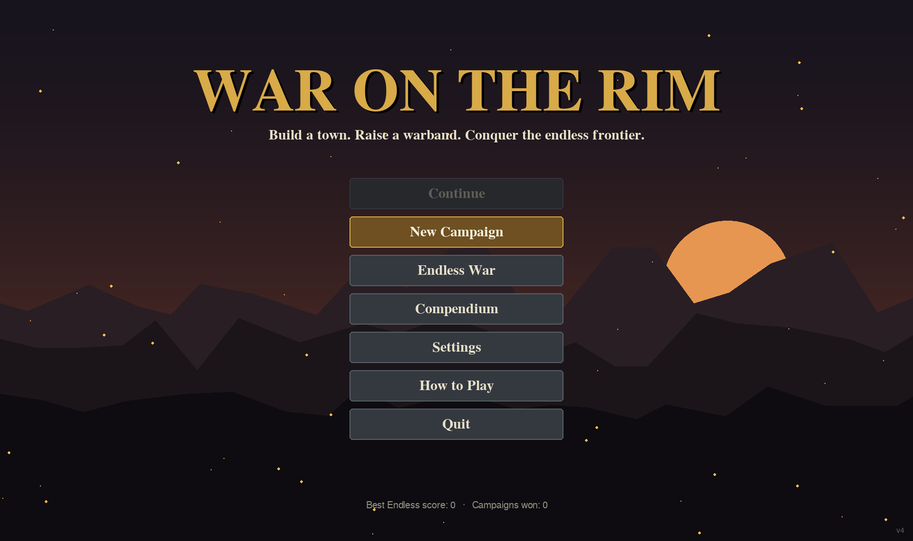
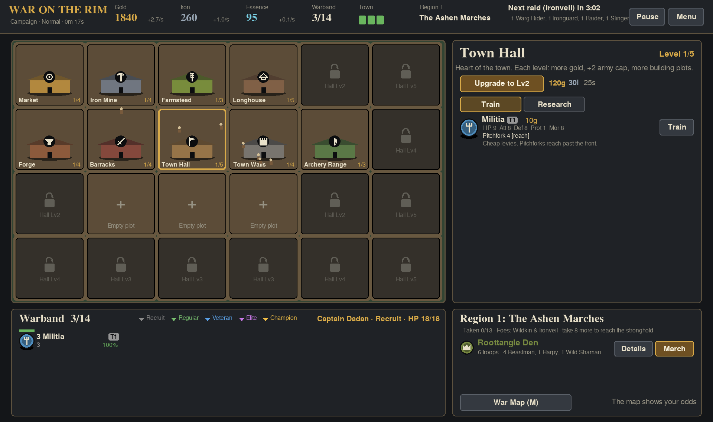
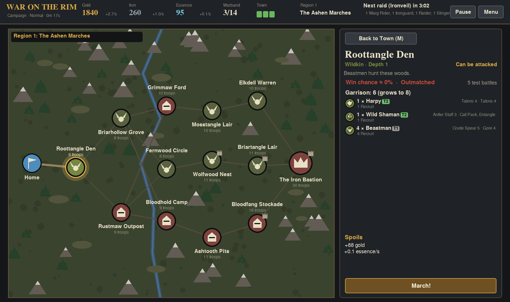
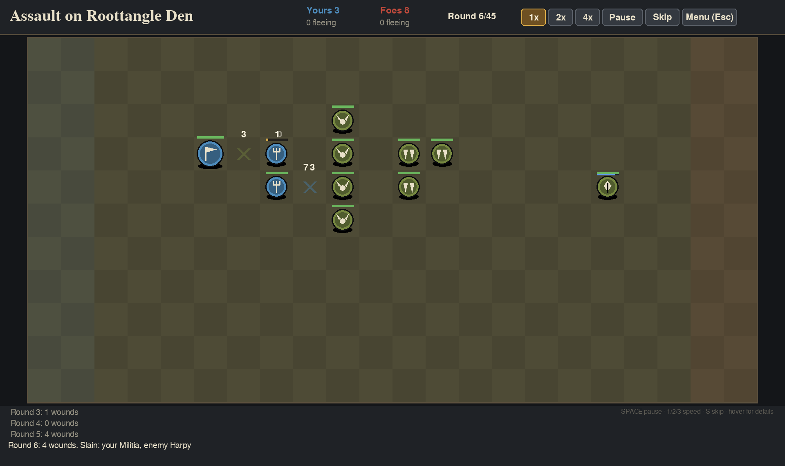

# War on the Rim

A real-time town builder with automatic, Conquest-of-Elysium-style battles. You rule a small frontier town: build it up, train a warband, and march out across a map that is freshly generated every game. Battles resolve on their own, round by round. Your choices are what you build, what you research, and who you bring.



## Running it

Requires Python 3.8+ and pygame 2.

```
pip install pygame
python war_on_the_rim.py
```

That's the whole install. There are no assets to download — the maps, the art, and every sound effect are generated at startup. Your save and settings are written next to the script as `war_on_the_rim_save.dat` and `war_on_the_rim_settings.json`.

## The game

**Your town runs in real time.** Gold, iron and essence tick up while you decide what to do with them. Buildings unlock units and research; the Town Hall gates how much you can build at once and how large your warband can grow. Raids arrive on a timer, so a town with no walls and no troops at home is a town that loses things.



**The war map is a fresh region every time.** Each site shows its garrison and an estimated win chance, worked out by simulating the fight in the background before you commit. Clear enough sites to reach the region's stronghold, take it, and push deeper — each new region is bigger and nastier than the last.



**Battles play themselves.** Units deploy, advance, shoot, cast spells, summon allies, strike with every weapon they carry, break, and flee. You watch at 1x, 2x or 4x, or skip straight to the result. Soldiers have names and earn experience across the whole campaign, climbing from Recruit through Regular, Veteran and Elite to Champion. Losing a Champion hurts.



**Modes:** Campaign (three regions, then the final Hold) or Endless War, each on Easy, Normal or Hard.

## Controls

| Where | Keys |
| --- | --- |
| Town and map | Click things. `M` war map, `P` pause, `H` chronicle, `C` compendium, `Esc` menu |
| Battle | `Space`/`P` pause, `1`/`2`/`3` speed, `S` skip, `Enter` continue, `Tab` switch report tab, `Esc` menu |
| Menus | Mouse, wheel to scroll, `Esc` to go back |

The window is resizable, and fullscreen (in Settings) renders at your monitor's native resolution.

## Credits

Built with [pygame](https://www.pygame.org/).
